# Kubesphere 集成 Spring Cloud 使用介绍

目前集成了“服务注册中心”、“配置中心”、“微服务网关”这三大模块，其中“微服务网关”中支持动态配置网关路由。


## 服务管理

服务管理中支持部署微服务应用，服务实例的上下线，实例权重管理，查看服务实例的监控信息、应用环境变量等操作。


### 应用启动参数注入方式

创建微服务实例的过程默认通过**命令行参数注入**的方式将参数传入应用中作为应用启动参数，除了参数注入还可以设置**环境变量注入**、**不注入**，设置方式如下：

在添加 Annocations 中添加以下配置

| Annotations                                   | 说明                             |
| --------------------------------------------- | -------------------------------- |
| springcloud.kubesphere.io/inject.method: env  | 以环境变量的方式注入             |
| springcloud.kubesphere.io/inject.method: arg  | 以命令行参数的方式注入，默认方式 |
| springcloud.kubesphere.io/inject.method: none | 不注入                           |


### 默认注入参数

通过命令行参数或环境变量注入的默认值有：

| properties                               | 说明                       | 默认值                 |
| ---------------------------------------- | -------------------------- | ---------------------- |
| spring.application.name                  | 应用名                     | 创建实例时填写的应用名 |
| spring.cloud.nacos.config.namespace      | 配置中心连接的命名空间     | 当前项目的项目名       |
| spring.cloud.nacos.config.server-addr    | 配置中心连接的地址         | 配置中心地址           |
| spring.cloud.nacos.discovery.namespace   | 服务注册中心连接的命名空间 | 当前项目的项目名       |
| spring.cloud.nacos.discovery.server-addr | 服务注册中心连接的地址     | 服务注册中心地址       |


### 不同注入方式对 bootstrap 的配置要求

- 命令行参数注入：可以不用 bootstrap 配置。若 bootstrap 配置中需要写连接到 nacos config 较复杂的 data-id 时就将 bootstrap 配置放在应用内或者用 configmap 将其挂载到镜像的 WORKDIR 下的 config 目录，以上会默认注入的值可写可不写。

- 环境变量注入：需要 bootstrap 配置。可以在微服务页面下载示例配置，将 bootstrap 配置文件中通过环境变量注入的值改写成示例变量。属性与变量对应规则如下：

  | properties                               | variable                                    |
  | ---------------------------------------- | ------------------------------------------- |
  | spring.application.name                  | ${SPRING_APPLICATION_NAME}                  |
  | spring.cloud.nacos.config.namespace      | ${SPRING_CLOUD_NACOS_CONFIG_NAMESPACE}      |
  | spring.cloud.nacos.config.server-addr    | ${SPRING_CLOUD_NACOS_CONFIG_SERVER_ADDR}    |
  | spring.cloud.nacos.discovery.namespace   | ${SPRING_CLOUD_NACOS_DISCOVERY_NAMESPACE}   |
  | spring.cloud.nacos.discovery.server-addr | ${SPRING_CLOUD_NACOS_DISCOVERY_SERVER_ADDR} |


以上注入方式中推荐使用默认的**命令行参数注入**方式，在使用过程中切换到不同的环境中部署时，原先的 bootstrap 配置文件内容不用做改变，自动会将以上连接注册中心和配置中心的参数将 bootstrap 配置文件中的内容覆盖掉。

> 注意：**命令行参数注入**这种方式对制作 Dockerfile 中的启动命令有一定要求，在 Dockerfile 中需要写成 `ENTRYPOINT` 指令，若通过 `CMD` 指令启动则注入的参数会把 `CMD` 中的命令覆盖掉。


### 注意项说明

> 1. 监控和应用环境变量的数据依赖于 `Spring Boot Actuator` ，需要在应用中引入 `Spring Boot Actuator` 依赖并在配置文件中配置相应的 endpoints 。


## 配置管理

配置管理中支持对配置的创建与分发，支持配置历史版本管理、回滚、复制。

> 注意：创建的配置生成的 Data Id 格式是：**名称.文件类型**。（如：文件类型选择的 YAML 则 Data Id 为 name.yaml ）


## 微服务网关管理

微服务网关管理支持基于SpringCloudGateway的网关部署，支持自定义网关镜像加载网关插件，网关路由的动态配置及分发。


### 自定义网关镜像

自定义网关镜像可以通过以下两种方式：

1. 在源代码的基础上重新构建 kubesphere-spring-cloud-gateway
2. 基于提供的  kubesphere-spring-cloud-gateway-starter 集成

以下是基于 `kubesphere-spring-cloud-gateway-starter` 拓展示例。


#### 示例

下面是一个自定义扩展的简单例子，它在发送到目标服务的请求中添加了一个HTTP头。

##### 自定义 Filter 示例代码

1. 创建项目，引入 starter 依赖

   ```xml
   <dependency>
       <groupId>io.kubesphere</groupId>
       <artifactId>kubesphere-spring-cloud-starter</artifactId>
       <version>${kubesphere-gateway.version}</version>
   </dependency>
   ```

2. 创建自定义 Filter 

   ```java
   package io.kubesphere.springcloud.extensions.filter;
   
   import io.kubesphere.springcloud.DynamicRouteController;
   import org.slf4j.Logger;
   import org.slf4j.LoggerFactory;
   import org.springframework.beans.factory.annotation.Autowired;
   import org.springframework.cloud.gateway.filter.GatewayFilter;
   import org.springframework.cloud.gateway.filter.factory.AbstractGatewayFilterFactory;
   import org.springframework.stereotype.Component;
   import org.springframework.web.server.ServerWebExchange;
   
   import java.util.Collections;
   
   @Component
   public class AddMyCustomHeaderGatewayFilterFactory
           extends AbstractGatewayFilterFactory<Object> {
   
       private static final Logger LOGGER = LoggerFactory.getLogger(AddMyCustomHeaderGatewayFilterFactory.class);
   
       private static final String MY_HEADER_KEY = "X-My-Header";
   
       @Autowired
       DynamicRouteController dynamicRouteController;
   
       @Override
       public GatewayFilter apply(Object config) {
           return (exchange, chain) ->
           {
               ServerWebExchange updatedExchange
                       = exchange.mutate()
                       .request(request -> {
                           request.headers(headers -> {
                               headers.put(MY_HEADER_KEY, Collections.singletonList("my-header-value"));
                               LOGGER.info("Processed request, added" + MY_HEADER_KEY + " header");
                           });
                       })
                       .build();
               return chain.filter(updatedExchange);
           };
       }
   }
   ```

3. resources 目录下创建 bootstrap 配置文件，在里面开启 `management.endpoints.web.exposure.include=*`

   ```yaml
   management:
     endpoints:
       web:
         exposure:
           include: "*"
   ```

4. 若没有自动创建 springboot 启动文件，就手动创建下

   ```java
   package io.kubesphere.springcloud.extensions;
   
   import org.springframework.boot.SpringApplication;
   import org.springframework.boot.autoconfigure.SpringBootApplication;
   
   @SpringBootApplication
   public class App {
       public static void main(String[] args) {
           SpringApplication.run(App.class, args);
       }
   }
   ```

5. 写 Dockerfile

   ```dockerfile
   FROM openjdk:8-alpine3.9
   WORKDIR /app
   COPY ./target/xxx.jar /app
   ENTRYPOINT ["java", "-jar", "xxx.jar"]
   ```

然后就打 jar 包，打 docker 镜像，将镜像推送到镜像仓库。

打 jar 包前注意检查是否添加了如下插件：

```xml
<build>
  <plugins>
    <plugin>
      <groupId>org.springframework.boot</groupId>
      <artifactId>spring-boot-maven-plugin</artifactId>
      <executions>
        <execution>
          <goals>
            <goal>repackage</goal>
          </goals>
        </execution>
      </executions>
    </plugin>
  </plugins>
</build>
```


##### 部署自定义网关后测试

在网关路由中添加如下网关路由

```yaml
- uri: http://localhost:8080
  predicates:
    - Path=/add-header/**
  filters:
    - StripPrefix=0
    - AddMyCustomHeader
```

如下请求：

```sh
curl ${ip}:${port}/add-header
```

然后在网关日志中可以看到 `Processed request, addedX-My-Header header` ，说明刚刚添加到过滤器已经生效了。


## springcloud-operator 系统参数介绍

#### 全局参数

| 参数名                    | 含义                                                         | 默认值                          | 可选值        |
| ------------------------- | ------------------------------------------------------------ | ------------------------------- | ------------- |
| metrics-bind-address      | The address the metric endpoint binds to.                    | 127.0.0.1:8080                  | customization |
| health-probe-bind-address | The address the metric endpoint binds to.                    | :8081                           | customization |
| server-port               | The server bind port.                                        | 9443                            | customization |
| leader-election           | Enable leader election for controller manager.               | false                           | true/false    |
| server-type               | Server Type.                                                 | nacos                           |               |
| leader-election-id        | LeaderElectionID determines the name of the resource that leader election will use for holding the leader lock. | spring-cloud-controller-manager | customization |
| cert-dir                  | CertDir is the directory that contains the server key and certificate. | 空                              | customization |
| gateway-role-name         | The default permissions for this are get list watch gatewayrouteconfigs. | kubesphere-spring-cloud-gateway | customization |


#### nacos 参数

| 参数名                      | 含义                                 | 默认值                                   | 可选值        |
| --------------------------- | ------------------------------------ | ---------------------------------------- | ------------- |
| nacos-server-host           | Nacos server host.                   | nacos.kubesphere-spring-cloud-system.svc | customization |
| nacos-server-port           | Nacos server port.                   | 8848                                     | customization |
| nacos-server-path           | Nacos server path.                   | /nacos                                   | customization |
| nacos-server-protocol       | Protocol of the nacos server.        | http                                     | http/https    |
| nacos-server-username       | Username.                            | nacos                                    | customization |
| nacos-server-password       | Password.                            | nacos                                    | customization |
| nacos-default-inject-method | Default inject method.               | arg                                      | arg/env/none  |
| nacos-generate-account      | Generate account for each namespace. | false                                    | true/false    |


## 1.5 兼容性及版本说明

### **nacos 版本：**

支持 nacos 2.x.x 版本，可在安装组件前在 ks-installer 中配置版本，默认采用 latest（目前是2.0.4），其他相关兼容性问题参照 nacos 官方文档即可。

### **微服务网关依赖版本：**

**主要的依赖项目及版本如下：**

```sh
org.springframework.cloud:spring-cloud-starter:3.1.1
+---org.springframework.boot:spring-boot-starter:2.6.3
org.springframework.cloud:spring-cloud-starter-gateway:3.1.1
org.springframework.cloud:spring-cloud-starter-circuitbreaker-reactor-resilience4j:2.1.1
com.alibaba.cloud:spring-cloud-starter-alibaba-nacos-discovery:2021.1
+--- com.alibaba.nacos:nacos-client:2.0.3
```

**直接依赖：**

spring-cloud-starter:3.1.1

spring-cloud-starter-gateway:3.1.1

spring-cloud-starter-circuitbreaker-reactor-resilience4j:2.1.1

spring-cloud-starter-alibaba-nacos-discovery:2021.1

**间接依赖：**

spring-boot-starter:2.6.3

nacos-client:2.0.3

**毕业版本依赖关系：**

| Spring Cloud Alibaba Version | Spring Cloud Version | Spring Boot Version |
| :--------------------------- | :------------------- | :------------------ |
| 2021.1                       | 2021.0.1             | 2.6.3               |


## 附

### 服务端鉴权策略说明

微服务中连接 nacos server 时使用的 nacos 中默认安全策略，即不开启鉴权系统。

**开启方式：**

1. 若已安装 nacos ：可以在 kubesphere-spring-cloud-system 命名空间下 nacos deployment 中添加相关开启鉴权系统的**环境变量**，NACOS_AUTH_ENABLE=true，其他相关配置见下表：

   | name                            | description                                        | option                                                       |
   | ------------------------------- | -------------------------------------------------- | ------------------------------------------------------------ |
   | NACOS_AUTH_ENABLE               | 是否开启权限系统                                   | 默认:false                                                   |
   | NACOS_AUTH_TOKEN_EXPIRE_SECONDS | token 失效时间                                     | 默认:18000                                                   |
   | NACOS_AUTH_TOKEN                | token                                              | 默认:SecretKey012345678901234567890123456789012345678901234567890123456789 |
   | NACOS_AUTH_CACHE_ENABLE         | 权限缓存开关 ,开启后权限缓存的更新默认有15秒的延迟 | 默认 : false                                                 |

2. 若未安装 nacos：在配置中把 nacos.auth.enabled 设置为 true ，其他相关参数见下表：

   | parameter                       | description                                        | default                                                      |
   | ------------------------------- | -------------------------------------------------- | ------------------------------------------------------------ |
   | `nacos.auth.enabled`            | 是否开启权限系统                                   | `false`                                                      |
   | `nacos.auth.tokenExpireSeconds` | token 失效时间                                     | `18000`                                                      |
   | `nacos.auth.token`              | token                                              | `SecretKey012345678901234567890123456789012345678901234567890123456789` |
   | `nacos.auth.cacheEnabled`       | 权限缓存开关 ,开启后权限缓存的更新默认有15秒的延迟 | `false`                                                      |

3. 在 kubesphere-spring-cloud-system 命名空间下的 spring-cloud-operator deployment 中传入**命令行参数**指定生成账户的配置（nacos-generate-account=true）。

这样设置后就会在 nacos server 开启鉴权系统，在 kubesphere 中创建命名空间时还会在该命名空间创建用户凭证，然后在该命名空间中部署微服务时会自动用该命名空间下的用户凭证连接 nacos server ，可以做到命名空间级别完全隔离。

参考：[nacos 鉴权](https://nacos.io/zh-cn/docs/auth.html)


# spring-cloud-bookinfo 部署 demo

Spring Cloud microservices demo coppied from Istio Bookinfo


整个微服务应用中包含了 5 个组件

1. productpage 是一个由 react 开发的前端组件
2. gateway 是一个由 spring-cloud-gateway 提供的 API 网关服务
3. details 是一个 spring-cloud 微服务，提供了书籍详情 API
4. reviews-v1 是一个 spring-cloud 微服务，提供了基础的书籍评论信息，review-v2 在 review-v1 的基础之上额外的提供了评分数据，依赖 ratings 服务
5. ratings 是一个 golang 开发的微服务组件

在 springcloud demo 中我们用到以上的组件有：productpage、details、reviews，另外网关使用定制化后可配置网关路由的网关镜像。


微服务上云，主要分为以下几个步骤：

1. 打包应用：将应用打包成可运行的应用包
2. 制作镜像：docker 根据 Dockerfile 打包成制定镜像
3. 推送镜像：将镜像推送到仓库，部署时到仓库中取镜像
4. 部署应用：将应用部署在 K8s 集群上

打包应用的过程也可写在制作镜像的 Dockerfile 中，以下示例就是采取的这种方式，下面就分为准备镜像、部署应用这两个大步骤操作。


## 准备镜像

前提：在本机上安装 docker ，并建好镜像仓库，以下示例用的镜像仓库使用的 [Docker Hub](https://hub.docker.com/) 镜像仓库。

### productpage

到项目的 productpage 目录下。

```sh
# 构建镜像
docker build -t hongzhouwei/productpage:v1 .
# 将镜像推送到镜像仓库
docker push hongzhouwei/productpage:v1
```


### details

到项目目录下，将项目目录下 Dockerfile 让里面 `ARG TARGET=deatils`。

```sh
# 构建镜像
docker build -t hongzhouwei/deatils:v1 .
# 将镜像推送到镜像仓库
docker push hongzhouwei/deatils:v1
```


### reviews

到项目目录下，将项目目录下 Dockerfile 让里面 `ARG TARGET=reviews`。

```sh
# 构建镜像
docker build -t hongzhouwei/reviews:v1 .
# 将镜像推送到镜像仓库
docker push hongzhouwei/reviews:v1
```


若没有准备镜像，可用以下镜像demo

```sh
hongzhouwei/productpage:latest
hongzhouwei/deatils:latest
hongzhouwei/reviews:latest
```


## 部署应用

### 在 Kubesphere 上启用 springcloud

**页面方式启用：**

使用 admin 账号登录后 -> 平台管理 -> 集群管理 -> CRD菜单栏 -> 编辑 ClusterConfiguration 中 ks-installer 将 spec.springcloud.enabled 设置为 true，也可在里面对部署的 nacos 参数自由配置，[参数说明](https://github.com/nacos-group/nacos-k8s/blob/master/helm/README.md#configuration)。


**命令行方式启用：**

```sh
kubectl -n kubesphere-system edit cc ks-installer
# 然后将 spec.springcloud.enabled 设置为 true，也可在里面对部署的 nacos 参数自由配置
```


### 部署配置 bookinfo

前提：在 ks 上安装后[创建企业空间、项目、用户和平台角色](https://kubesphere.com.cn/docs/quick-start/create-workspace-and-project/)再进行下面操作。

此示例中创建的企业空间为：xxx、项目名为：springcloud-demo、操作账户为：admin


一般部署微服务是根据服务的依赖性自底向上部署，基本步骤是：

1. 若有依赖的基础服务（如：mysql 、 redis 等），创建依赖的基础服务
2. 若有配置文件（如：nacos 配置中心管理的配置文件、configmap 管理的配置文件等），创建配置文件
3. 部署各个微服务应用

在 bookinfo 中没有其他依赖的基础服务，我们先为 details 、reviews 服务在配置管理中创建配置文件，再部署各个微服务应用。


#### 创建配置文件

为 details 、reviews 服务创建配置文件，内容都如下：

```yaml
management:
  endpoints:
    web:
      exposure:
        include: "*"
```

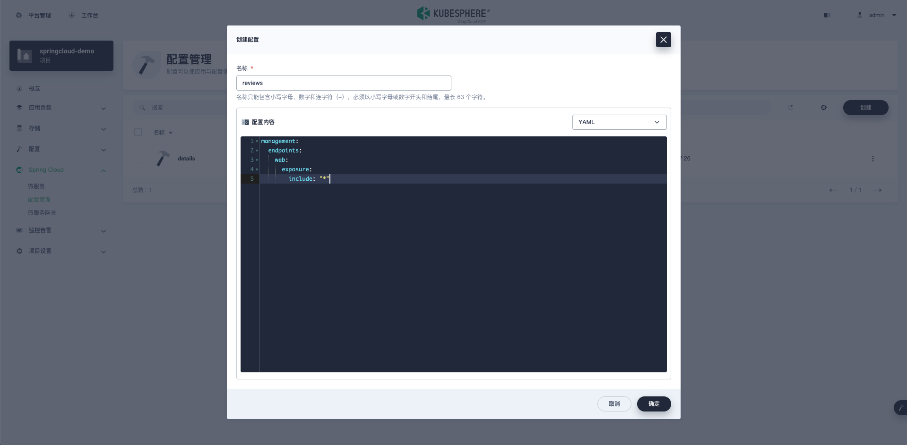

生成的 Data Id 格式是：**名称.文件类型**，这儿文件类型选择的 YAML 则 Data Id 为 details.yaml 和 reviews.yaml 。

在打包好的应用程序的 bootstrap.yml 中配置了连接配置中心的 Data Id 。

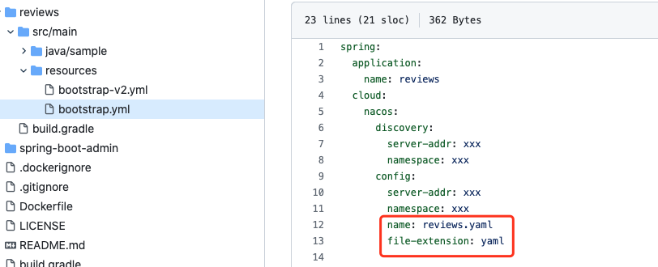


#### 一、productpage

是本示例中的前端访问入口，此前端项目不用在 Spring Cloud 微服务中部署，在【应用负载中部署成普通的工作负载】。

1. ##### 创建工作负载并通过环境变量指定网关地址

   填写镜像：前面我们构建的镜像是 `hongzhouwei/productpage:v1`，若没有构建镜像可以用`hongzhouwei/productpage:latest`demo， 那么这儿我们也就填写对应的镜像地址。

   设置环境变量：（API_SERVER : http://gateway.springcloud-demo.svc:8080）

   因为在前端项目中通过反向代理 访问 API 网关，通过环境变量配置 API 网关地址。网关我们下一步再部署，网关名字我们就设为 gateway、端口设为8080，那么这儿访问网关的地址就是  http://gateway.springcloud-demo.svc:8080 。

   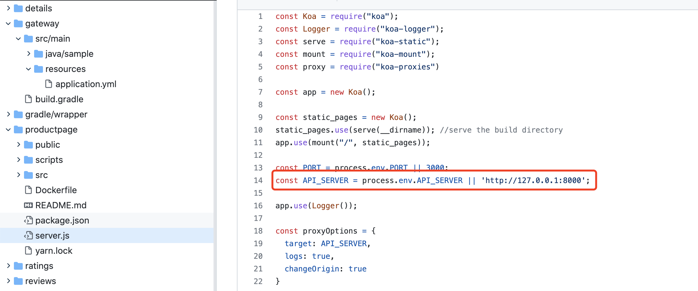

   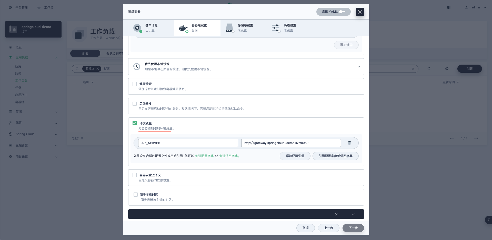

   

2. ##### 创建服务并指定工作负载

   因为这个服务是需要对外访问的前端应用，所以需要创建服务并在后面需要通过应用路由暴露出来。

   创建服务时需要关联到对应的工作负载，并填写对应端口。（productpage 用的 3000 端口，通过应用路由访问配置80端口）

   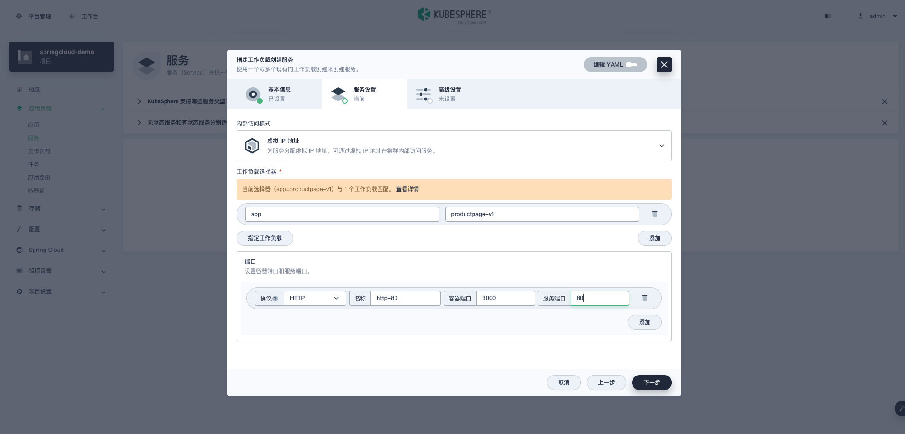

3. ##### 开启项目网关，创建应用路由对外提供访问

   开启网关，可以就用 NodePort 方式，直接点确定。

   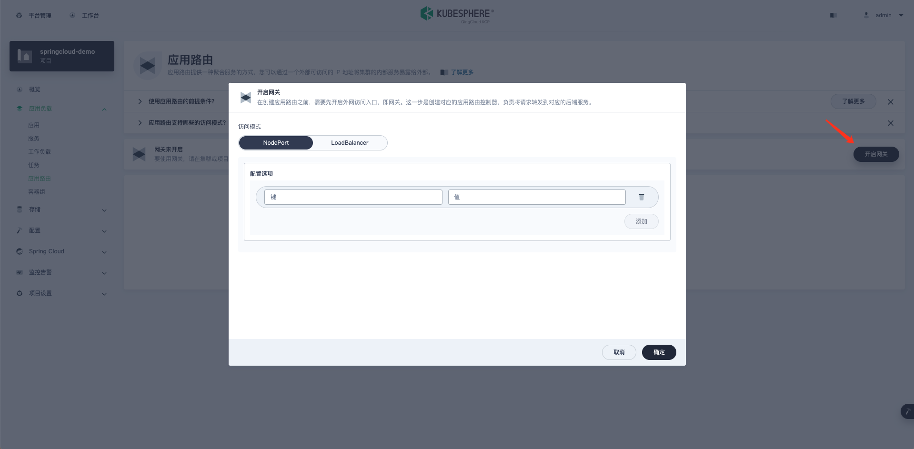

   创建应用路由：路由规则中设置成路由到前面创建的服务。

   创建后若访问不到，可能的问题有：

   1. 如果默认生成的内网的地址，那么需要在该路由中【更多操作】->【编辑YAML】把内网地址改成外网地址。
   2. 如果该端口访问不到，还需要在防火墙或安全组中将端口出来。

   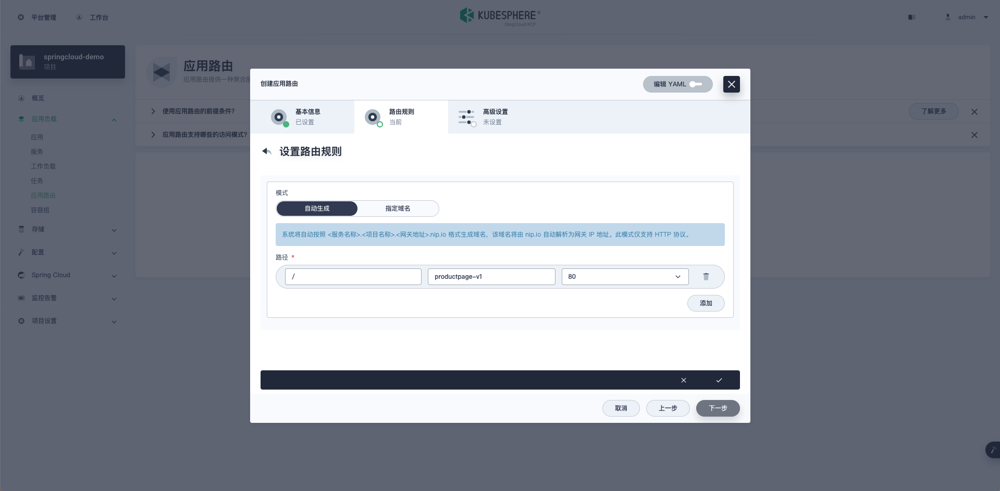

   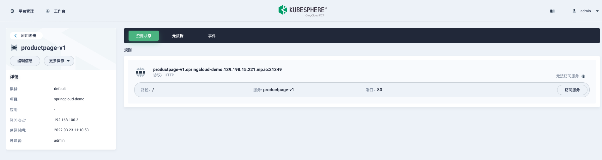

4. ##### 打开前端访问页面

   可以看到能访问到前端页面了，只是目前没有配置其他微服务，查看详情那些接口还请求不到数据。


#### 二、gateway

gateway 是一个 spring-cloud-gateway 应用，作为后端 API 的入口。这儿使用的网关是基于 springcloud 定制化的网关，在里面支持网关路由管理。

使用镜像：`hongzhouwei/spring-cloud-gateway:latest` 端口设置：容器端口和服务端口都为8080

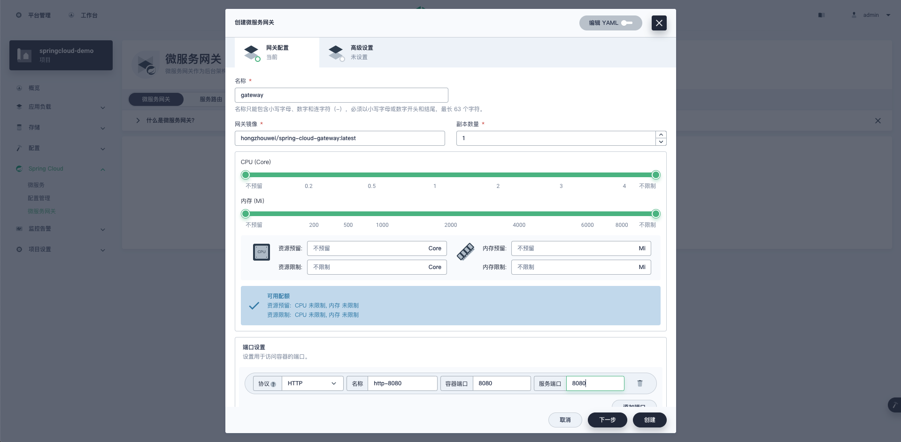

创建网关后会 apply 相应的 service 和 deployment。


#### 三、details

details 提供了具体的书籍详情 API，我们可以通过 product id 获取书籍的详细信息。这个是springcloud微服务，需要在【 Spring Cloud 微服务中部署】。

1. ##### 创建实例

   命名为：details。（**注意：在创建实例命名微服务时，名字中不要出现下划线，否则会出现找不该服务的问题。**）

   填写镜像：前面我们构建的镜像是 `hongzhouwei/details:v1`，若没有构建镜像可以用`hongzhouwei/datails:latest`demo， 那么这儿我们也就填写对应的镜像地址。

   端口设置：设置8080端口

   **创建实例后，一般需要等会儿才可以看到服务注册上来。创建过程可在应用负载->工作负载中看到。**

   

1. ##### 在微服务网关中配置服务路由

   配置规则可参照 springcloud-gateway ，这儿主要配置以下几项：

   ```yaml
           - id: details
             uri: lb://details
             predicates:
               - Path=/api/v1/products/*
   ```

   注意 uri 中 lb://xxx ，这儿 xxx 是微服务的名字，**在创建实例命名微服务时，名字中不要出现下划线**，否则会出现找不该服务的问题。

   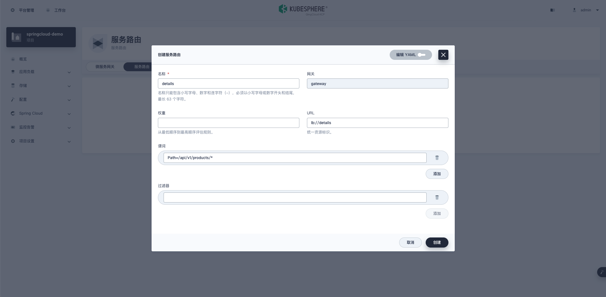

   

2. ##### 检查 productpage 中书籍详情是否正常显示

   可看到下面书籍详情页显示出来了。

   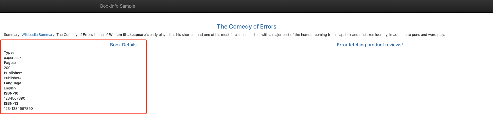


#### 四、reviews-v1

reviews 应用提供书籍评论相关的 API，可以通过配置开启是否展示评分。这个是springcloud微服务，需要在【 Spring Cloud 微服务中部署】

我们这儿部署 v1 版本的 reviews 后端服务，默认不展示书籍评分。

1. ##### 创建实例

   命名为：reviews-v1

   填写镜像：前面我们构建的镜像是 `hongzhouwei/reviews:v1`，若没有构建镜像可以用`hongzhouwei/reviews:latest`demo， 那么这儿我们也就填写对应的镜像地址。

   端口设置：设置8080端口

   

4. ##### 在微服务网关中配置服务路由

   配置规则可参照 springcloud-gateway ，这儿主要配置以下几项：

```
        - id: reviews-v1
          uri: lb://reviews-v1
          predicates:
            - Path=/api/v1/products/*/reviews
```


3. ##### 检查 productpage 中书籍评论是否正常显示

可看到下面书籍评论页显示出来了。

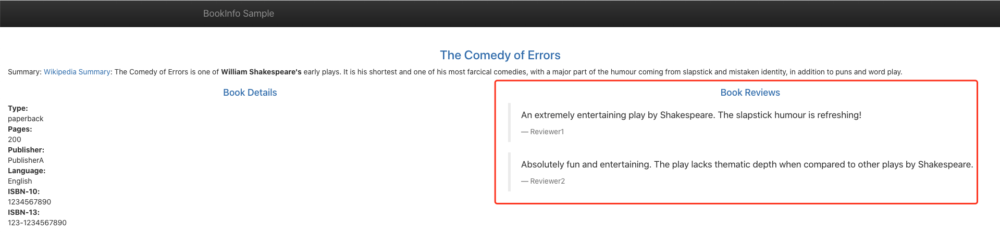


#### 五、reviews-v2

reviews-v2 用于演示灰度发布，相关 API 和 reviews-v1 一样，只是默认展示书籍评分。这个是springcloud微服务，需要在【 Spring Cloud 微服务中部署】

1. ##### 创建实例

   命名为：reviews-v2

   填写镜像：若没有构建镜像可以用`hongzhouwei/reviews:v2`demo。

   端口设置：设置8080端口

   

2. ##### 在微服务网关中配置服务路由

   配置规则可参照 springcloud-gateway ，这儿主要配置以下几项：

```
        - id: reviews-v2
          uri: lb://reviews-v2
          predicates:
            - Path=/api/v1/products/*/reviews
            - Weight=reviews, 50
```

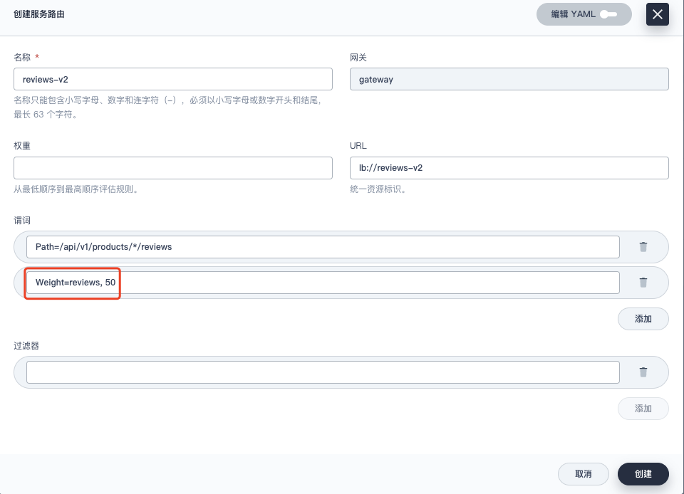


另外还需要更改服务路由中 reviews-v1 的配置，在谓词中加上 `Weight=reviews, 50` 。意思是 reviews-v1 和 reviews-v2 都位于 reviews 分组，同一分组下会按照给定的数值计算权重，即各占 `50/(50+50)` 50%。

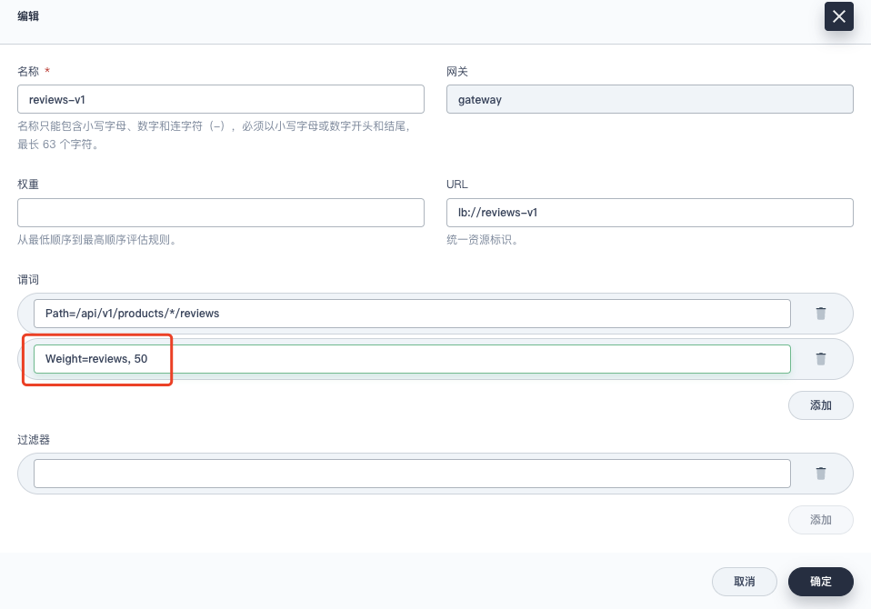

3. ##### 检查 productpage 中书籍评论是否正常显示

不断刷新页面，可以看到以下两种样式各占 50% 的概率。


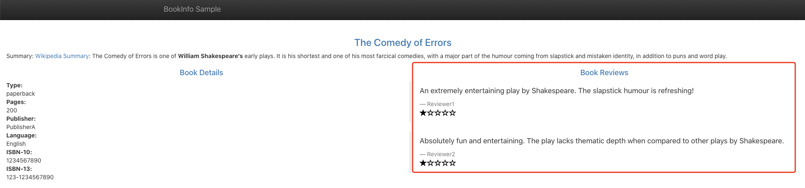


### 附：通过命令行部署

#### 服务

部署时和其他 Deployment 的差异就在于需要在 `metadata.labels` 中加上 `springcloud.kubesphere.io/app: applicationName` 数据项，如下所示：

```yaml
kind: Deployment
apiVersion: apps/v1
metadata:
  name: details
  namespace: springcloud-demo
  labels:
    app: details
    springcloud.kubesphere.io/app: details # require
spec:
  replicas: 1
  selector:
    matchLabels:
      app: details
      springcloud.kubesphere.io/app: details # require
  template:
    metadata:
      labels:
        app: details
        springcloud.kubesphere.io/app: details # require
    spec:
      containers:
        - name: container-t01agm
          image: 'hongzhouwei/details:latest'
          ports:
            - name: http-8080
              containerPort: 8080
              protocol: TCP

```

